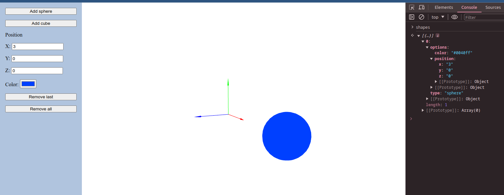

# Setup
```
npm install
npm run dev
```

Make sure you have `npm` installed.

The project should open automatically in your browser at `localhost:8080`


# Assignment

Using this sample 3D project, develop a Cypress test suite to run integrated tests. The test coverage is left to your discretion. You can use the global variable `shapes` for validation. You need to provide your assignment in a form that's suitable for us to run (a Github repository, a zip file, etc.)


